# Sphere Encoder in PyTorch

[ [**arXiv**](https://arxiv.org/abs/2602.15030) ] [ [**webpage**](https://sphere-encoder.github.io) ]

<br>
<p align="center">
  
  
</p>
<br>

This repository contains the PyTorch code for reproducing the results in the paper [**Image Generation with a Sphere Encoder**](https://arxiv.org/abs/2602.15030).

## Install 

```bash
pip install --no-cache-dir torch torchvision fvcore numpy tqdm wandb git+https://github.com/LTH14/torch-fidelity.git
```

## Training

To train a model from scratch on **CIFAR-10**, run the following command:

```bash
./scripts/train_cifar10.sh
```

A folder named `./workspace/` will be created to store everything related to training, evaluation, and visualization.
The training jobs will be organized in `./workspace/experiments/` as follows:

```bash
./workspace/experiments/
|── sphere-base-base-cifar-10-32px
    |── ckpt  # checkpoints
    |── vis   # visualization
    |── cfg.json  # configuration 
    |── log.txt   # training log
```

For other datasets such as **ImageNet**, **Animal Faces**, and **Oxford Flowers**, first need to prepare dataset list files (`train.json`, `val.json`, or `test.json`). 
Place these files in the `./workspace/datasets/imagenet/` directory.

Each entry in the JSON files should follow this format:

```json
{"class_id": 0, "class_name": "imagenet", "image_path": "/absolute/path/to/imagenet.jpg", "is_absolute_path": true}
```

Once the dataset files are prepared, run the following command to begin training:

```bash
./scripts/train_imagenet.sh
```

The other datasets can be downloaded from the following links:

| dataset | link1 | link2 |
| :---: | :---: | :---: |
| Animal Faces | [kaggle](https://www.kaggle.com/datasets/andrewmvd/animal-faces) | [stargan](https://github.com/clovaai/stargan-v2/blob/master/README.md#animal-faces-hq-dataset-afhq) |
| Oxford Flowers | [kaggle](https://www.kaggle.com/datasets/nunenuh/pytorch-challange-flower-dataset) | [vgg/data](https://www.robots.ox.ac.uk/~vgg/data/flowers/102/) |

After preparing the dataset files, run the corresponding training scripts:

```bash
./scripts/train_af.sh  # for animal faces
./scripts/train_of.sh  # for oxford flowers
```

## Evaluation

| fid artifacts | :hugs: hf dataset repo |
| :---: | :---: |
| data statistic files | [`fid_stats`](https://huggingface.co/datasets/kaiyuyue/sphere-encoder-fid-artifacts) |
| reference images | [`fid_refs`](https://huggingface.co/datasets/kaiyuyue/sphere-encoder-fid-artifacts) |

Download the FID artifacts from above links and put them in `./workspace/`.
The directory tree should look like this:

```bash
./workspace/
├── fid_stats
    |── fid_stats_extr_animal-faces_256px.npz
    |── fid_stats_extr_cifar-10_32px.npz
    |── fid_stats_extr_flowers-102_256px.npz
    |── fid_stats_rand-50k_imagenet_256px.npz
├── fid_refs
    |── ref_images_imagenet_256px/images
```

To evaluate a trained model, for example, `./workspace/experiments/sphere-base-base-cifar-10-32px` created by the CIFAR-10 training script, run the following command:

```bash
./run.sh eval.py \
  --job_dir sphere-base-base-cifar-10-32px \
  --forward_steps 1 4 \
  --report_fid rfid gfid \
  --use_cfg True \
  --cfg_min 1.2 \
  --cfg_max 1.2 \
  --cfg_position combo \
  --rm_folder_after_eval True
```

The evaluation results will be saved in `./workspace/experiments/sphere-base-base-cifar-10-32px/eval/` with a table format.

## Model Card

For ease of comparison and reproducibility, please see the model card in [MODEL.md](MODEL.md). 
It details our trained models, evaluation scripts, and the performance results reported in the paper.

## Image Generation

```bash
# --job_dir can be
#   sphere-l-af, sphere-l-of, sphere-l-imagenet, or sphere-xl-imagenet

./run.sh sample.py \
  --job_dir sphere-xl-imagenet \
  --num_gen_samples 16 \
  --class_of_interests 980 985
```

Output images can be found in `./workspace/visualization/`, which will look like:

<p align="center">
  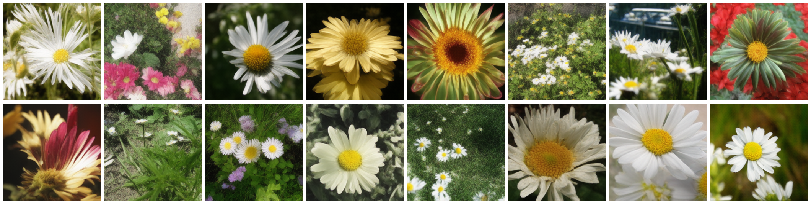
  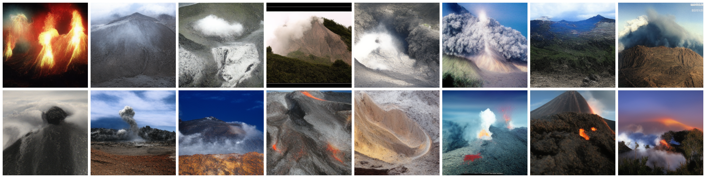
</p>

## Latent Interpolation

```bash
./run.sh lerp.py \
  --job_dir sphere-l-of \
  --grid_nrow 16
```

Output images can be found in `./workspace/interpolation/`, which will look like:

<p align="center">
  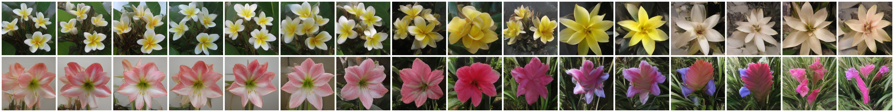
</p>

We can also try to interpolate 4 images with bilinear interpolation (blerp):

```bash
./run.sh lerp.py \
  --job_dir sphere-l-af \
  --interp_mode blerp \
  --grid_nrow 8 \
  --grid_ncol 8 \
  --num_trials 25
```

Output images look like:

<p align="center">
  
</p>

## Image Crossover

```bash
./run.sh edit.py \
  --edit_mode crossover \
  --input_image images/dog.jpg \
  --extra_image images/cat.jpg \
  --job_dir sphere-l-af \
  --noise_strength_scaler 0.25 \
  --stitch_mode tri_backward \
  --stitch_swap True
```

Output images can be found in `./workspace/image_editing/`, which will look like:

<p align="center">
  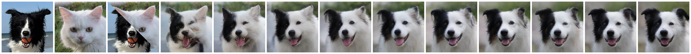
  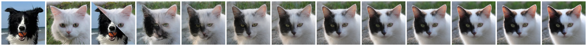
</p>

We can also try different stitching modes and swapping, for example:

```bash
--stitch_mode tri_backward \
--stitch_swap False
```

Output images will look like:

<p align="center">
  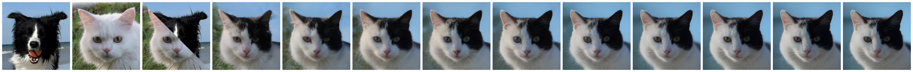
  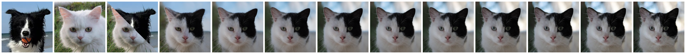
</p>

## Conditional Manipulation

```bash
./run.sh edit.py \
  --edit_mode condition \
  --input_image images/wolly_panda.jpg \
  --job_dir sphere-l-imagenet \
  --noise_strength_scaler .25 \
  --num_trials 10 \
  --forward_steps 5
```

Output images can be found in `./workspace/image_editing/`, which will look like:

<p align="center">
  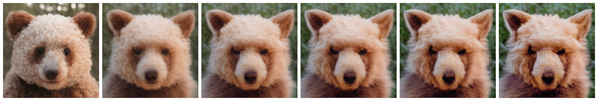
  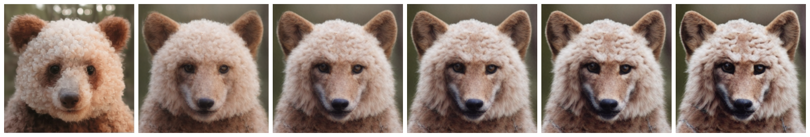
  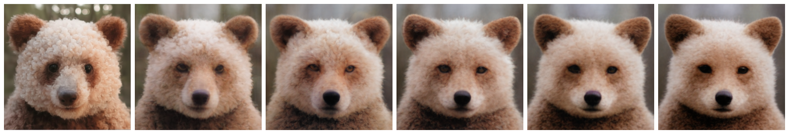
  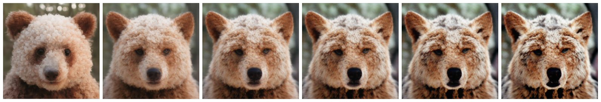
</p>

## Image Reconstruction

Here we use the sphere encoder trained **only on Oxford-Flowers** to reconstruct the OOD images, which is a more challenging setting.
To reconstruct an input image, run the following command:

```bash
./run.sh edit.py \
  --edit_mode reconstruction \
  --job_dir sphere-l-of \
  --input_image images/cake.jpg
```

| image A and reconstruction | image B and reconstruction | image C and reconstruction |
| :---: | :---: | :---: |
|  | 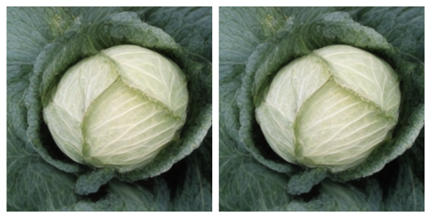 | 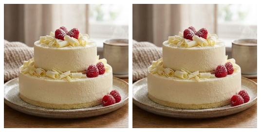 |

## License

The code is licensed under the [CC-BY-NC 4.0 License](LICENSE).
